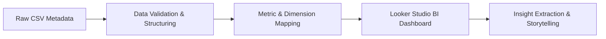

# 📊 YouTube Trending Video Analytics Dashboard

An interactive data visualization and business intelligence project analyzing the architectural patterns, audience engagement, and performance metrics of the Top 1000 Most Popular YouTube Videos Worldwide.

---

## 📌 Project Overview

This business intelligence project investigates the metadata of the **Top 1000 Most Popular YouTube Videos Worldwide**. 

By transforming raw multi-country tabular data into a centralized interactive analytics dashboard, this project uncovers hidden distribution patterns, engagement velocity, and temporal upload trends. The end goal is to demonstrate how data-driven storytelling can guide content creators and digital marketing stakeholders in optimizing global reach.

---

## 🎯 Project Objectives

- **Trend Identification:** Analyze the core distribution of viral video categories on a global scale.
- **Engagement Analytics:** Deep-dive into user behavior matrices (Views vs. Likes vs. Comments).
- **Temporal & Geo-Mapping:** Isolate peak upload lifecycles and geolocational production output.
- **BI Development:** Build a dynamic, production-ready dashboard inside Google Looker Studio.
- **Actionable Insights:** Translate raw charts into clear, strategic storytelling pointers.

---

## 🛠️ Analytics Tooling & Stack

- **BI Visualization Platform:** Google Looker Studio
- **Data Source Ingestion:** Structured Flat Files (CSV Dataset)
- **Data Engineering (Roadmap):** Python (Pandas & NumPy) for automated preprocessing pipelines.

---

## 🔄 Analytics & Dashboard Workflow

---

## 📂 Data Schema Information

The analytical models are evaluated based on key structural columns within the global dataset:
- **Identifier & Text:** `Video Title`, `Channel Title`, `Channel Country`
- **Categorical Tagging:** `Video Category`
- **Engagement Metrics:** `Views Count`, `Likes Count`, `Comments Count`
- **Temporal Dimensions:** `Upload Year` / `Date`

---

## 📊 Dashboard Preview & Live Access

### 🌐 Live Interactive Dashboard
✨ **Explore the Active Report:** [YouTube Trending Video Dashboard Live Link](https://lookerstudio.google.com/reporting/9cf686df-3bfb-49df-8cec-e28011b818c5)

### 📸 Static Layout Capture

  

---

## 🔍 Key Business Insights

- 🎵 **Category Monopoly:** The **Music** vertical heavily dominates the ecosystem, capturing nearly **60%** share of the Top 1000 viral index.
- 😂 **Engagement Velocity:** While Music drives high volume views, **Entertainment & Comedy** sectors yield much higher active user commentary and engagement density.
- 🌎 **Geographical Hub:** Over half of the historically viral content structures originate from channels registered in the **United States (US)**.
- ⏳ **High Shelf-Life Content:** Video structures deployed during the **2018–2020** temporal range continue to hold significant long-term ranking supremacy, highlighting immense content durability.

---

## 🧠 Key Learnings

- Formulating explicit metrics, calculated fields, and interactive multi-page parameters in Looker Studio.
- Mapping high-dimensional categorical data into readable visual hierarchies.
- Isolating signal from noise within public social platform metadata arrays.

---

## 🚀 Future Improvements

- Embed an automated Python pipeline to handle automated deduplication and anomaly detection.
- Scale ingestion to support real-time data streaming via YouTube API integration.
- Deploy predictive models to estimate video view-velocity benchmarks.
- Add direct integration into a SQL data warehouse layer (Google BigQuery).

---

## 👨‍💻 Author

**Imammul Arif**  
📍 Indonesia  
🔗 LinkedIn: https://linkedin.com/in/imammularif  
🔗 GitHub: https://github.com/imammularif

